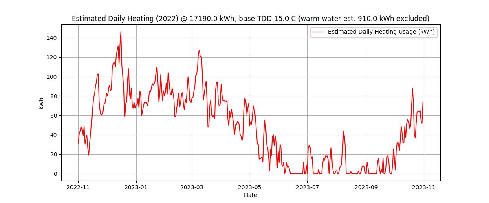

# District heating simulator
Attemt to retrospectively inspect district heating usage/cost for a Aalborg based house by way of Heating Degree Days (HDD) using metrological wind-chill data at location.

Excluding rebate of 2% per centigrade of cooling below expected return temperature of district heating water, the cost per day for 2025 in Aalborg is 0.994 DKK/kWh.
E.g. rebate for cooling supply at 75C down to 28C is $(34C-28C)*0.02*cost_{kWh}=0.119 DKK/kWh$. Based on values from [Aalborg Forsyning - Varmeudnyttelsestakst 2024](https://www.aalborgforsyning.dk/media/wusbcmtr/aalborg-varme-leveringsbestemmelser-tillaeg-til-bilag-2-varmeudnyttelsestakst-1-juli-2024-endeligversion-16042024-1.pdf). 

